<a href="https://github.com/andr2116d/andr2116d/blob/main/README.en.md">
<picture>
  <source media="(prefers-color-scheme: dark)" srcset="assets/header-en-dark.svg">
  
</picture>
</a>

<!-- AHORA:INICIO -->
<a href="https://github.com/andr2116d/gemelo-socioeconomico-ll"><picture><source media="(prefers-color-scheme: dark)" srcset="assets/now/now-en-dark.svg"></picture></a>
<!-- AHORA:FIN -->

<a href="https://github.com/andr2116d">
<picture>
  <source media="(prefers-color-scheme: dark)" srcset="assets/lang-es-off-dark.svg">
  
</picture>
</a>
&nbsp;
<a href="https://github.com/andr2116d/andr2116d/blob/main/README.en.md">
<picture>
  <source media="(prefers-color-scheme: dark)" srcset="assets/lang-en-on-dark.svg">
  
</picture>
</a>

<a href="https://github.com/andr2116d/andr2116d/blob/main/README.en.md">
<picture>
  <source media="(prefers-color-scheme: dark)" srcset="assets/about-en-dark.svg">
  
</picture>
</a>

<a href="https://www.linkedin.com/in/johel-andre%C3%A9-vargas-villanueva-2309862b8">
<picture>
  <source media="(prefers-color-scheme: dark)" srcset="assets/contact-linkedin-dark.svg">
  
</picture>
</a>
&nbsp;
<a href="https://www.instagram.com/andvtr_2">
<picture>
  <source media="(prefers-color-scheme: dark)" srcset="assets/contact-instagram-dark.svg">
  
</picture>
</a>

 

<a href="https://github.com/andr2116d/andr2116d/blob/main/README.en.md">
<picture>
  <source media="(prefers-color-scheme: dark)" srcset="assets/stack/title-en-dark.svg">
  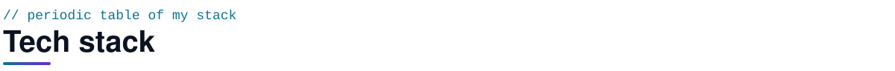
</picture>
</a>

<a href="https://github.com/andr2116d/andr2116d/blob/main/README.en.md">
<picture>
  <source media="(prefers-color-scheme: dark)" srcset="assets/stack/stack-en-dark.svg">
  
</picture>
</a>

<!-- PROYECTOS:INICIO -->
<a href="https://github.com/andr2116d/andr2116d/blob/main/README.en.md"><picture><source media="(prefers-color-scheme: dark)" srcset="assets/projects/title-en-dark.svg">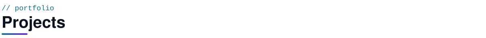</picture></a>

  <a href="https://github.com/andr2116d/Quikko"><picture><source media="(prefers-color-scheme: dark)" srcset="assets/projects/quikko-en-dark.svg"></picture></a>
  <a href="https://github.com/andr2116d/UNITRU-ACADEMIC"><picture><source media="(prefers-color-scheme: dark)" srcset="assets/projects/unitru-academic-en-dark.svg"></picture></a>

  <a href="https://github.com/andr2116d/gemelo-socioeconomico-ll"><picture><source media="(prefers-color-scheme: dark)" srcset="assets/projects/gemelo-socioeconomico-ll-en-dark.svg"></picture></a>

Live demos: <a href="https://quikko.vercel.app/">Quikko ↗</a> &nbsp;·&nbsp; <a href="https://unitru-academic.vercel.app">UNITRU Academic ↗</a> &nbsp;·&nbsp; <a href="https://gemelo-socioeconomico-ll.vercel.app">Gemelo Socioeconómico LL ↗</a>

<!-- PROYECTOS:FIN -->

 

<a href="https://github.com/andr2116d/andr2116d/blob/main/README.en.md">
<picture>
  <source media="(prefers-color-scheme: dark)" srcset="assets/stats/title-en-dark.svg">
  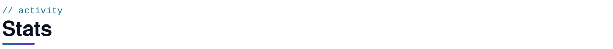
</picture>
</a>

<a href="https://github.com/andr2116d/andr2116d/blob/main/README.en.md">
<picture>
  <source media="(prefers-color-scheme: dark)" srcset="assets/stats/stats-en-dark.svg">
  
</picture>
</a>

<a href="https://github.com/andr2116d/andr2116d/blob/main/README.en.md">
<picture>
  <source media="(prefers-color-scheme: dark)" srcset="assets/stats/snake-dark.svg">
  
</picture>
</a>

 

<a href="https://github.com/andr2116d/andr2116d/blob/main/README.en.md">
<picture>
  <source media="(prefers-color-scheme: dark)" srcset="assets/footer-en-dark.svg">
  
</picture>
</a>