<a href="https://github.com/andr2116d">
<picture>
  <source media="(prefers-color-scheme: dark)" srcset="assets/header-es-dark.svg">
  
</picture>
</a>

<a href="https://github.com/andr2116d">
<picture>
  <source media="(prefers-color-scheme: dark)" srcset="assets/lang-es-on-dark.svg">
  
</picture>
</a>
&nbsp;
<a href="https://github.com/andr2116d/andr2116d/blob/main/README.en.md">
<picture>
  <source media="(prefers-color-scheme: dark)" srcset="assets/lang-en-off-dark.svg">
  
</picture>
</a>

